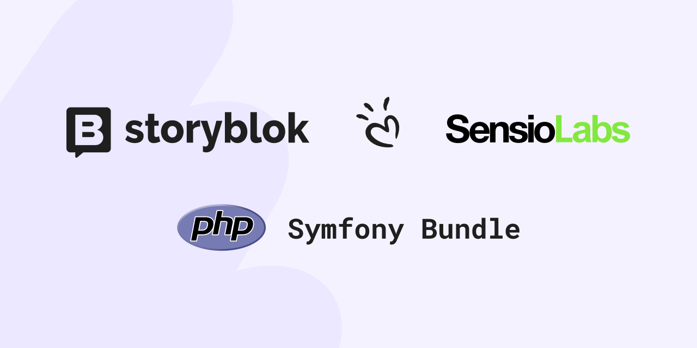
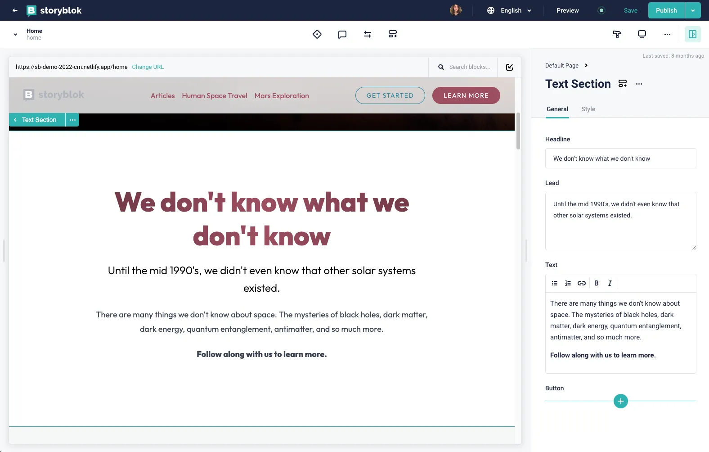

<div align="center">
    
    <h1 align="center">Storyblok Symfony Bundle</h1>
    <p align="center">Co-created with <a href="https://sensiolabs.com/">SensioLabs</a>, the creators of Symfony.</p>
</div>

| Branch   | PHP                                                                                                                                                                          | Code Coverage                                                                                                                      |
|----------|------------------------------------------------------------------------------------------------------------------------------------------------------------------------------|------------------------------------------------------------------------------------------------------------------------------------|
| `master` | [](https://github.com/sensiolabs-de/storyblok-bundle/actions/workflows/ci.yaml) | [](https://codecov.io/gh/storyblok/symfony-bundle) |

A Symfony bundle to integrate the [Storyblok headless CMS](https://www.storyblok.com/) with your Symfony application.

This bundle leverages the [storyblok/php-content-api-client](https://github.com/storyblok/php-content-api-client), a type-safe PHP
SDK for Storyblok. It configures the Storyblok client and provides a Symfony Profiler extension for easier debugging and
monitoring of Storyblok API interactions.

## Installation

To install the bundle run:

```bash
composer require storyblok/php-content-api-client storyblok/symfony-bundle
```

## Configuration

### Symfony Flex

If you are using `symfony/flex`, the bundle will be automatically enabled and the configuration files will be added to
your project.

### Manual Configuration

If `symfony/flex` is not available, or you prefer manual setup, follow these steps:

1. **Add the Configuration**
   Add the following configuration to your `config/packages/storyblok.yaml`:

    ```yaml
    storyblok:
      base_uri: '%env(STORYBLOK_API_BASE_URI)%'
      token: '%env(STORYBLOK_API_TOKEN)%'
    ```

    If you want to use the AssetsApi, you can also add the following configuration:

    ```yaml
    storyblok:
      # ...
      assets_token: '%env(STORYBLOK_ASSETS_API_TOKEN)%'
    ```

2. **Set Environment Variables**
   Define the necessary environment variables in your `.env` file:

    ```dotenv
    STORYBLOK_API_BASE_URI=https://api.storyblok.com
    STORYBLOK_API_TOKEN=your_storyblok_api_token
    ```

## Usage

### API Usage

After setting up the bundle, you can use the Storyblok client within your Symfony application to interact with the
Storyblok CMS API.

For detailed usage and examples, please refer to
the [Storyblok API SDK documentation](https://github.com/sensiolabs-de/storyblok-api).

### Versions (`draft` and `published`)

Storyblok allows you to work with two versions of your content: `draft` and `published`. By default, the bundle uses the
`published` version. If you want to use the `draft` version, you can set the `version` parameter in the configuration:

```yaml
storyblok:
    # ...
    version: draft
```

### Webhooks

Storyblok Webhooks allow your Symfony application to react to events like content changes. This bundle provides easy
setup for handling these Webhooks.

#### Configuration

To enable Webhooks, add the following route to your application:

```yaml
# config/routes/storyblok.yaml
storyblok_webhook:
    resource: '@StoryblokBundle/config/routes/webhook.php'

storyblok_content_type:
    resource: '@StoryblokBundle/config/routes/content_type.php'
```

This will make a route available at `/storyblok/webhook` to receive Webhook requests. For more details on how Webhooks
work, check the [Storyblok Webhooks Documentation](https://www.storyblok.com/docs/guide/in-depth/webhooks).

#### Verifying Webhook Signatures (Security)

For security, you can enable the verification of Webhook signatures to ensure that the requests come from Storyblok.
This is done by configuring a `webhook_secret`:

```yaml
# config/packages/storyblok.yaml
storyblok:
    # ...
    webhook_secret: '%env(STORYBLOK_WEBHOOK_SECRET)%'
```

You'll need to set this secret in your `.env` file:

```dotenv
STORYBLOK_WEBHOOK_SECRET=your_webhook_secret
```

Once enabled, the bundle will automatically validate each Webhook request against this secret.

#### Handling Webhook Events

To process Webhooks, implement the `WebhookHandlerInterface`. The bundle automatically registers any classes
implementing this interface as Webhook handlers, no additional service configuration is required.

**Example Webhook Handler**

Here's an example of a Webhook handler that purges a Varnish cache whenever certain events occur (e.g., content
published or deleted):

```php
<?php

namespace App\Webhook;

use Storyblok\Bundle\Webhook\Event;
use Storyblok\Bundle\Webhook\Handler\WebhookHandlerInterface;

final class PurgeVarnishHandler implements WebhookHandlerInterface
{
    public function handle(Event $event, array $payload): void
    {
        // Your custom logic for handling the event
        // Example: purging Varnish cache
    }

    public function supports(Event $event): bool
    {
        // Specify the events your handler supports
        return $event->equalsOneOf([
            Event::StoryPublished,
            Event::StoryUnpublished,
            Event::StoryDeleted,
            Event::StoryMoved,
        ]);
    }

    public static function priority(): int
    {
        // Define the priority for your handler
        return -2000;
    }
}
```

#### Best Practices

- **Handle Only Necessary Events**: Use the `supports` method to filter only the Webhook events your handler should
  process.
- **Prioritize Handlers**: If you have multiple handlers, set the priority appropriately. Handlers with higher
  priority (lower integer value) are executed first.
- **Add Logging**: It's a good idea to log incoming Webhooks and any actions performed, especially for debugging and
  monitoring.

This approach provides a streamlined and secure way to handle Webhooks from Storyblok, allowing your Symfony application
to react to changes effectively. For more details and use cases, you can always refer to
the [Storyblok API SDK documentation](https://github.com/storyblok/php-content-api-client).

#### Auto resolve relations

If you want to update relations automatically, you can enable this with the following configuration:

```yaml
# config/packages/storyblok.yaml
storyblok:
    # ...
    auto_resolve_relations: true
```

This will replace `StoriesApi` to `StoriesResolvedApi`. The `StoriesResolvedApi` will automatically resolve relations.

> [!WARNING]
> Maximum 50 different relations can be resolved in one request. See
> [Storyblok docs](https://www.storyblok.com/docs/api/content-delivery/v2/stories/retrieve-a-single-story)
> for more information

## Content Type Handling & Routing

The bundle provides a convenient way to handle Storyblok content types and integrate them into your Symfony routing.

### Create a Content Type object

A content type object is a PHP class that represents a Storyblok content type. For example the following code

> [!TIP]
> Consider using the `HelperTrait` included in this bundle to streamline the handling of Storyblok API responses.
> Real-world content data is often inconsistent — keys may be missing, values may have unexpected formats, or fields might be empty.
> The helper methods in this trait handle these edge cases for you, allowing you to write clean, defensive, and readable code with minimal boilerplate.
>
> [Read more →](#helpers)

```php
// ...
use Storyblok\Bundle\ContentType\ContentType;
use Storyblok\Bundle\Util\HelperTrait;

final readonly class Page extends ContentType
{
    use HelperTrait;

    public string $uuid;
    public string $title;
    private \DateTimeImmutable $publishedAt;

    public function __construct(array $values)
    {
        $this->uuid = self::string($values, 'uuid');
        $this->publishedAt = self::DateTimeImmutable($values, 'published_at');

        $content = $values['content']
        $this->title = self::string($content, 'title');
    }

    public function publishedAt(): \DateTimeImmutable
    {
        return $this->publishedAt;
    }
}
```

By default, the content type technical name is derived from the class name, converted to `snake_case`.
If you want to use a different name, you can override the `type()` static method:

```php
// ...
    public static function type(): string
    {
        return 'my-custom-type-name';
    }
```

This will affect the request to the Storyblok API, which will now look for the content type with the technical name `my-custom-type-name`.

> [!WARNING]
> Be sure that your content type in Storyblok has the same technical name as defined in your class, otherwise
> the controller will not be able to resolve the content type correctly and will return a 404 error.

### Register your Symfony controller

To register your Symfony controller as a Storyblok content type controller, use the `#[AsContentTypeController]`
attribute.

```php
// ...
use App\ContentType\Page\Page;
use Storyblok\Bundle\ContentType\Attribute\AsContentTypeController;
use Symfony\Component\HttpFoundation\Request;
use Symfony\Component\HttpFoundation\Response;

#[AsContentTypeController(contentType: Page::class)]
final readonly class DefaultPageController
{
    public function __invoke(Request $request, Page $page): Response
    {
        return new Response('I am on page ' . $page->title . ' with locale ' . $request->getLocale());
    }
}
```

In case you need a dedicated controller for a specific slug but also need one for the content type itself you can add
the `slug` argument to the `#[AsContentTypeController]` attribute.

```php
// ...
use App\ContentType\Page\Page;
use Storyblok\Bundle\ContentType\Attribute\AsContentTypeController;
use Symfony\Component\HttpFoundation\Request;
use Symfony\Component\HttpFoundation\Response;

#[AsContentTypeController(contentType: Page::class, slug: 'legal/imprint')]
final readonly class ImprintController
{
    public function __invoke(Request $request): Response
    {
        return new Response('I am on the legal page with locale ' . $request->getLocale());
    }
}
```

Controllers marked with the `#[AsContentTypeController]` attribute will be tagged with
`storyblok.content_type.controller` and `controller.service_arguments`.

### Caching

The bundle provides a global caching configuration to enable HTTP caching directives, which
are disabled by default. We strongly recommend enabling these in `prod` environment. When you use symfony flex your
configuration should be automatically added to your `config/packages/storyblok.yaml` file.

```yaml
storyblok:
    # ...

when@prod:
    storyblok:
        controller:
            cache:
                public: true
                max_age: 3600
                smax_age: 3600
                must_revalidate: true
```

In case you need a specific caching configuration for a specific controller you can use Symfony's `#[Cache]` attribute
or modifying the `Response` object directly. This will cause that the global configuration is being ignored.

```php
// ...
use App\ContentType\Page\Page;
use Storyblok\Bundle\ContentType\Attribute\AsContentTypeController;
use Symfony\Component\HttpFoundation\Response;
use Symfony\Component\HttpKernel\Attribute\Cache;

#[AsContentTypeController(contentType: Page::class)]
#[Cache(
    maxage: 9000,
    public: true,
    smaxage: 9000,
    mustRevalidate: false
)]
final readonly class SpecialController
{
    public function __invoke(): Response
    {
        // ...
    }
}
```

### Fallback to Parent Routes (ascending_redirect_fallback)

When working with nested Storyblok content structures, it’s possible that users might request a URL path that doesn’t
correspond to a specific published content entry—for example, a section overview like `/blog/author`.

To provide a more graceful fallback behavior, the Storyblok Symfony Bundle introduces an ascending redirect fallback
feature that can be enabled via configuration:

```yaml
storyblok:
    # ...
    controller:
        ascending_redirect_fallback: true # Default false
```

When this option is enabled, the bundle will automatically redirect upward in the content tree until it finds a valid
route, instead of immediately returning a 404 Not Found.

Given the following content structure in Storyblok:

```text
/blog
/blog/my-fancy-post
/blog/categories
/blog/categories/my-category
/blog/author/kent-clark
```

If a user visits /blog/author, and this route does not exist, the bundle will attempt to redirect to its closest
existing parent route. In this case, it would redirect to `/blog`.

This provides a smoother user experience by guiding users to relevant content rather than showing a 404 error.

If no valid parent route can be found, a standard 404 response will still be returned.

## Block Registration with `#[AsBlock]`

You can register Storyblok blocks using the `#[AsBlock]` attribute.

The `name` and `template` parameters are optional, you will find their defaults in the following section.

### Usage

> [!TIP]
> Consider using the `HelperTrait` included in this bundle to streamline the handling of Storyblok API responses.
> Real-world content data is often inconsistent — keys may be missing, values may have unexpected formats, or fields might be empty.
> The helper methods in this trait handle these edge cases for you, allowing you to write clean, defensive, and readable code with minimal boilerplate.
>
> [Read more →](#helpers)

To define a block, use the attribute on a class:

```php
use Storyblok\Bundle\Block\Attribute\AsBlock;
use Webmozart\Assert\Assert;

#[AsBlock(name: 'sample', template: 'custom_blocks/sample.html.twig')]
final readonly class SampleBlock
{
    public string $title;
    public string $description;

    public function __construct(array $values)
    {
        Assert::keyExists($values, 'title');
        $this->title = $values['title'];

        Assert::keyExists($values, 'description');
        $this->description = $values['description'];
    }
}
```

### Attribute Parameters

| Parameter  | Type    | Required? | Description |
|------------|--------|-----------|-------------|
| `name`     | `string` | No | The block name used in Storyblok. Defaults to the class name converted to snake_case. |
| `template` | `string` | No | The Twig template for rendering the block. Defaults to `blocks/{name}.html.twig`. |

### Customizing the Default Template Path

You can change the default template path structure by configuring it in `storyblok.yaml`:

```yaml
# config/packages/storyblok.yaml
storyblok:
    blocks_template_path: 'my/custom/path'
```

### Rendering Blocks in Twig

A new `render_block` Twig filter allows easy rendering of Storyblok blocks:

```twig

    
        {{ block|render_block }}
    

```

This ensures dynamic rendering of Storyblok components with minimal effort.

### Rich Text Rendering

This bundle provides a convenient rich_text Twig filter to render Storyblok Rich Text fields using
the [storyblok/php-tiptap-extension](https://github.com/storyblok/php-tiptap-extension) library. You can directly use
the `rich_text` filter in your Twig templates:

```twig
<div>
    {{ story.content|rich_text }}
</div>
```

It works out of the box with:
- A default TipTap editor configuration
- Automatic rendering of registered Storyblok blocks using the `Storyblok\Bundle\Block\BlockRegistry`

## Enabling Storyblok’s Live Editor

This integration lets the Storyblok Visual Editor highlight components directly on your frontend and open the corresponding editing form automatically. Here’s how to set it up:

1. **Load the Storyblok bridge script**

> [!IMPORTANT]
> The javascript bridge is only loaded when the parameter `storyblok.version` is set to `draft`.

In your `base.html.twig` layout, include the Storyblok JavaScript bridge:


```diff
<!DOCTYPE html>
<html>
<head>
    <meta charset="UTF-8">
    <title>Hello world</title>
</head>
<body>

    

+   {{ storyblok_js_bridge_scripts() }}
</body>
</html>
```

This script is responsible for detecting editable components on the page and opening the Live Editor when clicked.

2. **Make your block classes “editable”**

Every block you want editable in the Live Editor must implement the `EditableInterface` and use the `EditableTrait`,
allowing them to receive Storyblok’s `_editable` metadata:

```diff
// ...
+ use Storyblok\Api\Domain\Type\Editable;
+ use Storyblok\Bundle\Editable\EditableInterface;
+ use Storyblok\Bundle\Editable\EditableTrait;

#[AsBlock]
-final readonly class MyBlock
+final readonly class MyBlock implements EditableInterface
{
+    use EditableTrait;

    /**
     * @param array<string, mixed> $values
     */
    public function __construct(array $values)
    {
         // ...
+        $editable = null;
+        if (\array_key_exists('_editable', $values)) {
+            $editable = new Editable($values['_editable']);
+        }
+        $this->editable = $editable;
    }
}
```

> [!TIP]
> Consider using the `HelperTrait` included in this bundle to streamline the handling of Storyblok API responses.
> Real-world content data is often inconsistent — keys may be missing, values may have unexpected formats, or fields might be empty.
> The helper methods in this trait handle these edge cases for you, allowing you to write clean, defensive, and readable code with minimal boilerplate.
>
> [Read more →](#helpers)

This setup ensures Storyblok provides the necessary metadata to each block instance.

3. **Render editable markers in your templates**

Insert Storyblok attributes into your HTML elements using the Twig filter. These attributes tell the bridge where each
editable block is located:

```twig
<div {{ block|storyblok_attributes }} class="my-class">
    {# Your block’s HTML output #}
</div>
```

With this in place, components are “highlightable” in the Live Editor — clicking them opens the edit form seamlessly.




### Helpers

The `Storyblok\Bundle\Util\HelperTrait` provides utility methods for mapping raw Storyblok data arrays into strong PHP value objects, enums, and domain models. These helpers reduce boilerplate code and improve readability in DTO constructors or factory methods.

Use this trait in your value objects or models to simplify the parsing and validation of Storyblok field values.

#### Available Methods

| Method                | Description                                                                                                      |
|-----------------------|------------------------------------------------------------------------------------------------------------------|
| `one()`               | Expects exactly one item (e.g. from a `blocks` field). Instantiates one object from it.                          |
| `list()`              | Maps a list of items to objects. Allows setting `$min`, `$max`, or exact `$count` constraints.                   |
| `nullOrOne()`         | Same as `one()`, but allows the field to be optional (returns `null` if empty).                                  |
| `Blocks()`            | Resolves a list of blocks using the `BlockRegistry`. Returns instances of block classes. Ignores unknown blocks. |
| `enum()`              | Maps a string value to a backed enum. Supports default value and whitelisting of allowed values.                 |
| `DateTimeImmutable()` | Returns a `Safe\DateTimeImmutable` object from a given date string.                                              |
| `Uuid()`              | Returns a `Storyblok\Api\Domain\Value\Uuid` instance from a string.                                              |
| `Asset()`             | Maps an asset array to a `Storyblok\Api\Domain\Type\Asset` object.                                               |
| `nullOrAsset()`       | Same as `Asset()`, but allows null or invalid input.                                                             |
| `MultiLink()`         | Maps a multilink array to a `Storyblok\Api\Domain\Type\MultiLink` object.                                        |
| `nullOrMultiLink()`   | Same as `MultiLink()`, but returns `null` if `url` and `id` are missing or empty.                                |
| `RichText()`          | Maps rich text content to a `Storyblok\Api\Domain\Type\RichText` object.                                         |
| `nullOrRichText()`    | Same as `RichText()`, but returns `null` if content is empty or only contains whitespace.                        |
| `boolean()`           | Returns `true` if the key exists and its value is `true`, otherwise `false`.                                     |
| `zeroOrInteger()`     | Returns an integer from the field, or `0` if missing.                                                            |
| `zeroOrFloat()`       | Returns a float from the field, or `0.0` if missing.                                                             |
| `string()`            | Returns a trimmed non-empty string (using `TrimmedNonEmptyString`). Optional max length check.                   |
| `nullOrString()`      | Same as `string()`, but returns `null` if missing or invalid.                                                    |
| `nullOrEditable()`    | Returns an `Editable` instance or `null`.                                                                        |

## License

This project is licensed under the MIT License. Please see [License File](LICENSE) for more information.
